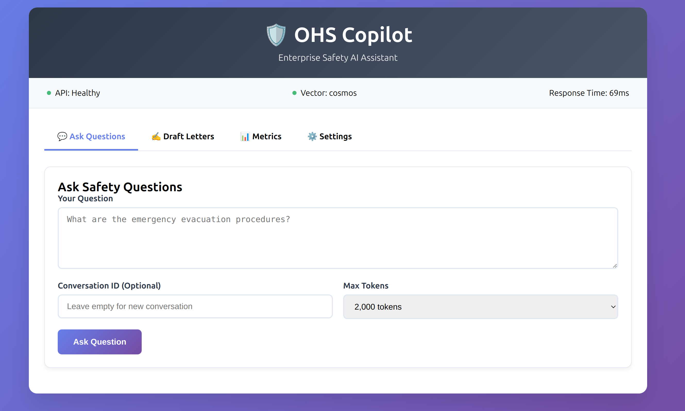

# OHS Copilot

Enterprise RAG (Retrieval-Augmented Generation) system with multi-agent orchestration, built on .NET 9, Microsoft Semantic Kernel, and Azure OpenAI.

## 🚀 Quick Start

**Prerequisites:** 
- [.NET 9 SDK](https://dotnet.microsoft.com/download/dotnet/9.0)
- Azure OpenAI API key

**Setup:**
```bash
git clone <repository-url>
cd ohs
./quick-start.sh
```

This will:
- Set up your Azure OpenAI configuration
- Install dependencies  
- Start the API at http://localhost:5000
- Open web interface at http://localhost:8080

**Add knowledge base:**
```bash
./add-knowledge-base.sh
```

**Test it:**
```bash
curl -X POST "http://localhost:5000/api/ask" \
  -H "Content-Type: application/json" \
  -d '{"question": "What should I do in case of fire?"}'
```

## What This Is

A complete reference implementation demonstrating:

- **Multi-Agent RAG Pipeline**: Router → Retriever → Drafter → Cite Checker
- **Vector Search**: Semantic search across workplace safety documents  
- **Enterprise Features**: Audit logging, telemetry, content safety, conversation memory
- **Production Architecture**: Clean architecture, dependency injection, configuration management

**Tech Stack**: .NET 9, C#, Microsoft Semantic Kernel, Azure OpenAI, Cosmos DB, ASP.NET Core, xUnit

Built for learning enterprise AI application development patterns and best practices.

## Screenshot

